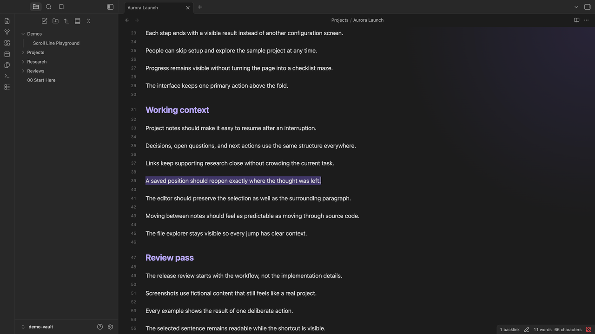
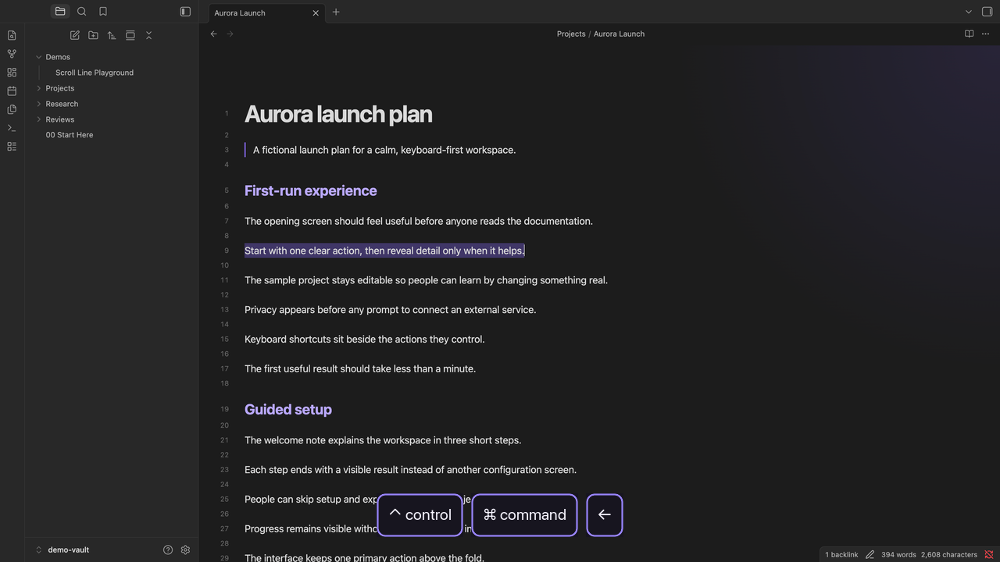
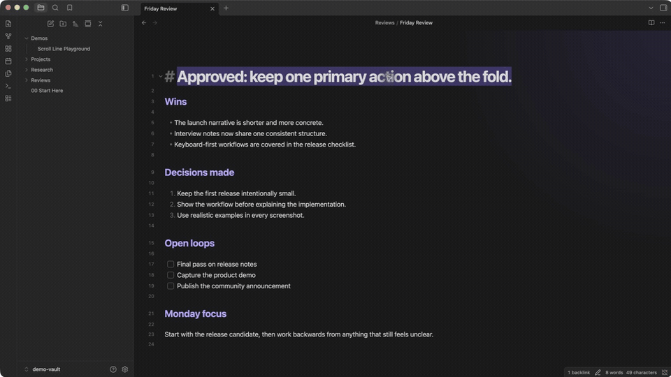

# Cursor History

  <strong>Go back to the exact place you were.</strong> 
  Move through exact cursor and selection positions, including several places inside one Obsidian note.

  

| One note, several positions | Back to an earlier selection in the same note |
| --- | --- |
|  |  |

## See it in action

The demo moves through several saved positions inside long notes, then crosses between notes. The live keystroke display appears as each navigation happens.

  <a href="docs/assets/cursor-history-demo.mp4">Watch the full-quality recording</a>

## What it does

- Reopens the note, restores the exact cursor or selection, and brings it into view
- Navigates backward and forward through recent cursor and selection locations
- Groups ordinary movements within 10 lines into one stop, while deliberate jumps create new stops
- Creates a new stop when you change files
- Keeps up to 200 positions for the current Obsidian session

Going back and then navigating somewhere new clears the forward history, matching browser behavior.

## Shortcuts

| Action | Editing mode default |
| --- | --- |
| Go back | `Ctrl` + `Cmd` + `Left` |
| Go forward | `Ctrl` + `Cmd` + `Right` |

Change either binding in **Settings > Hotkeys** by searching for “Cursor History.”

## Install

Open [Cursor History in the Obsidian Community directory](https://community.obsidian.md/plugins/cursor-history), then press **Add to Obsidian**.

For a manual installation, download `main.js` and `manifest.json` from the [latest release](https://github.com/AbdelrahmanHafez/obsidian-cursor-history/releases/latest), then place them in `<vault>/.obsidian/plugins/cursor-history/`.

## License

[MIT](LICENSE)
